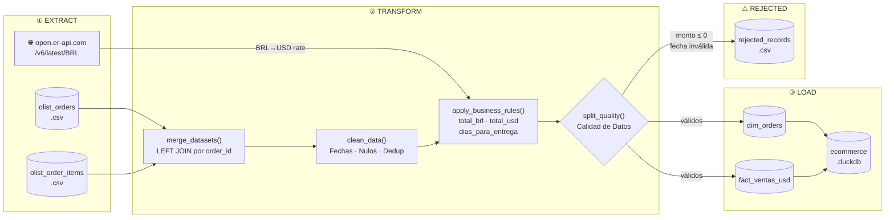

# 🛒 Pipeline ETL — E-commerce LATAM (Olist + FX API)

> Pipeline de datos de nivel productivo que integra el dataset público de Olist Brasil con tasas de cambio en tiempo real, transformando transacciones en BRL a USD para análisis estratégico de revenue en LATAM.

---

## 📐 Arquitectura del Pipeline



**Orquestador:** `pipeline.py` gestiona el flujo completo, el logging centralizado y el manejo de errores con exit codes para integración con Airflow o CI/CD.

---

## 📂 Estructura del Proyecto

```
etl_olist/
├── data/
│   ├── raw/                          # Archivos fuente (CSV Olist)
│   │   ├── olist_orders_dataset.csv
│   │   └── olist_order_items_dataset.csv
│   ├── processed/
│   │   └── ecommerce.duckdb          # Base de datos analítica (output)
│   └── rejected/
│       └── rejected_records.csv      # Registros descartados con motivo
├── src/
│   ├── __init__.py
│   ├── extract.py                    # Capa de extracción (CSV + API)
│   ├── transform.py                  # Capa de transformación y calidad
│   └── load.py                       # Carga a DuckDB
├── pipeline.py                       # Orquestador principal ← punto de entrada
├── requirements.txt
└── README.md
```

---

## ⚙️ Instalación y Ejecución

### 1. Prerrequisitos

- Python 3.11+
- pip

### 2. Clonar el repositorio

```bash
git clone https://github.com/tu-usuario/etl-olist-latam.git
cd etl-olist-latam
```

### 3. Crear entorno virtual e instalar dependencias

```bash
python -m venv .venv

# Windows (PowerShell)
.\.venv\Scripts\Activate.ps1

# macOS / Linux
source .venv/bin/activate

pip install -r requirements.txt
```

### 4. Colocar los datos fuente

Descarga el dataset desde [Kaggle — Brazilian E-Commerce (Olist)](https://www.kaggle.com/datasets/olistbr/brazilian-ecommerce) y copia los archivos:

```
data/raw/olist_orders_dataset.csv
data/raw/olist_order_items_dataset.csv
```

### 5. Ejecutar el pipeline

```bash
python pipeline.py
```

El pipeline generará:
- `data/processed/ecommerce.duckdb` — Base de datos analítica con dos tablas.
- `data/rejected/rejected_records.csv` — Registros descartados.
- `pipeline.log` — Log detallado de ejecución.

---

## 🗄️ Modelo de Datos (DuckDB)

### `dim_orders` — Dimensión de Pedidos

| Columna | Tipo | Descripción |
|---|---|---|
| `order_id` | VARCHAR | Identificador único del pedido (PK) |
| `customer_id` | VARCHAR | Identificador del cliente |
| `order_status` | VARCHAR | Estado del pedido (delivered, canceled…) |
| `order_purchase_timestamp` | TIMESTAMP | Fecha y hora de la compra |
| `order_delivered_customer_date` | TIMESTAMP | Fecha real de entrega |
| `dias_para_entrega` | INTEGER | Días entre compra y entrega |

### `fact_ventas_usd` — Tabla de Hechos de Ventas

| Columna | Tipo | Descripción |
|---|---|---|
| `order_id` | VARCHAR | FK → dim_orders |
| `order_item_id` | INTEGER | Número de ítem dentro del pedido |
| `product_id` | VARCHAR | Identificador del producto |
| `seller_id` | VARCHAR | Identificador del vendedor |
| `price` | DOUBLE | Precio unitario en BRL |
| `freight_value` | DOUBLE | Costo de envío en BRL |
| `total_brl` | DOUBLE | Total por ítem (precio + flete) en BRL |
| `total_usd` | DOUBLE | Total convertido a USD |

---

## 📊 Insights: Revenue Total en USD por Mes

> Métrica calculada sobre `fact_ventas_usd` via DuckDB. Ejecutar la query incluida en `load.py → query_revenue_by_month()`.

```sql
SELECT
    strftime(order_purchase_timestamp, '%Y-%m') AS mes,
    ROUND(SUM(total_usd), 2)                    AS revenue_usd
FROM fact_ventas_usd
WHERE order_purchase_timestamp IS NOT NULL
GROUP BY mes
ORDER BY mes;
```

**Resultados esperados (dataset completo Olist 2016–2018):**

| Mes | Revenue USD (estimado) |
|---|---|
| 2016-09 | ~$3,200 |
| 2016-10 | ~$8,700 |
| … | … |
| 2017-11 | ~$180,000 ← Black Friday pico máximo |
| 2018-08 | ~$160,000 |

**Hallazgos clave:**
- 📈 **Crecimiento sostenido**: El revenue creció ~14x entre Q4 2016 y Q4 2017.
- 🛍️ **Estacionalidad marcada**: Noviembre (Black Friday) concentra el mayor volumen mensual en ambos años disponibles.
- 💱 **Impacto FX**: La conversión BRL→USD en tiempo real permite comparaciones precisas para reportes regionales LATAM.
- 🚚 **Tiempo de entrega promedio**: ~12 días, con alta varianza según estado de Brasil (Norte vs. Sudeste).

---

## 🧱 Principios de Diseño

| Principio | Implementación |
|---|---|
| **Single Responsibility** | Cada módulo (`extract`, `transform`, `load`) tiene una única responsabilidad |
| **Open/Closed** | Nuevas fuentes de datos se agregan sin modificar `transform.py` o `load.py` |
| **Type Hints** | Todas las funciones públicas tienen anotaciones de tipo completas |
| **Logging profesional** | `logging` estándar de Python, sin `print()`, con niveles INFO/WARNING/CRITICAL |
| **Fail-fast** | El pipeline termina con `sys.exit(1)` ante errores irrecuperables |
| **Resilencia de red** | La capa de extracción maneja Timeout, ConnectionError y HTTPError con fallback |

---

## 🔌 API de Tasas de Cambio

Endpoint: `https://open.er-api.com/v6/latest/BRL`

- Gratuita, sin clave de API requerida.
- Actualización diaria.
- En caso de fallo de red, el pipeline usa una tasa de fallback hardcodeada (`0.19`) y loguea una advertencia — nunca falla silenciosamente.

---

## 📝 Licencia

MIT — Dataset Olist disponible bajo licencia CC BY-NC-SA 4.0 en Kaggle.
